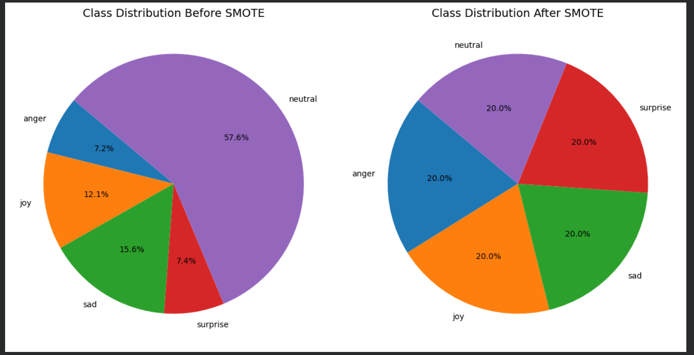
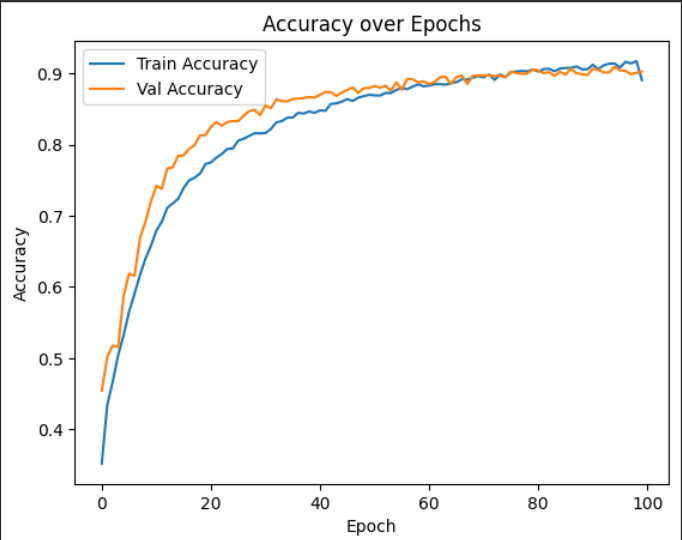

# 🎭 Hindi Emotion Detection

This project predicts emotions from Hindi text using a hybrid deep learning model based on **mBERT** embeddings and a **BiLSTM** classifier.  
The system classifies text into five emotions:

- Anger  
- Joy  
- Sadness  
- Surprise  
- Neutral  

---
## 📸 Preview

---

## 📌 Features

- Emotion detection using mBERT + BiLSTM  
- Streamlit web application for real-time predictions  
- Dataset visualization and class balancing using SMOTE  
- Model evaluation with accuracy, loss, ROC curve and confusion matrix  

---

## 🧠 Model Architecture

- **mBERT (bert-base-multilingual-cased)** for text embeddings  
- **BiLSTM** network for sequence classification  
- **Softmax** output layer for 5 emotion classes  

---

## 📁 Project Structure

Hindi-Emotion-Detection/
│── README.md
│── app.py
│── requirements.txt
│── .gitignore
│
├── models/
│ └── HindiEmotion.h5
│
├── data/
│ └── Bhaav-Dataset.xlsx
│
├── notebooks/
│ └── HindiBilstmFinal.ipynb
│
├── images/
│ ├── Model Performance Metrics.png
│ ├── Emotion Class Performance.png
│ ├── confusion_matrix.png
│ ├── roc_curve.png
│ ├── accuracy_epochs1.png
│ ├── accuracy_epochs2.png
│ ├── smote_before_after.png
│ ├── class_distribution.png
│ └── ...
│
└── streamlit_app/
├── app.py
└── images/

yaml
Copy code

---

## ▶️ Run the Project

### Install dependencies:
pip install -r requirements.txt

shell
Copy code

### Run the Streamlit app:
streamlit run app.py

yaml
Copy code

---

## 📊 Dataset

Dataset used: **Bhaav Dataset (Hindi Emotion Corpus)**  
Stored in `data/Bhaav-Dataset.xlsx`

The dataset contains labeled Hindi sentences for training the model.

---

## 📈 Model Performance

The model was trained for 100 epochs and evaluated using:

- Accuracy  
- Precision, Recall, F1-score  
- ROC curves  
- Confusion matrix  

Below are some performance graphs included in the project.

---

## 📸 Visuals

Here are some of the important plots generated during training and evaluation:

### Class Distribution Before & After SMOTE

### Accuracy Over Epochs

### Confusion Matrix

### ROC Curve

---

## 📜 License

This project is open-source and available under the **MIT License**.

🌐 Author :Madhukumar Kareti

📫 Connect on LinkedIn :  [www.linkedin.com/in/madhukumar-kareti-b59155275](https://www.linkedin.com/in/madhukumar-kareti-b59155275/)
